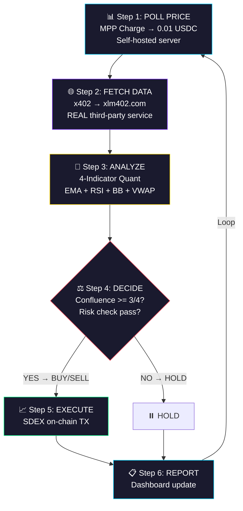

# 🏆 StellarTradeAgent — Implementation Plan v5 (FINAL)

> **Nama Proyek:** StellarTradeAgent
> **Tagline:** *"An OpenClaw-powered AI agent that autonomously pays for real market intelligence and trades on Stellar SDEX"*
> **Repo:** `e:\DATA\Ngoding\hackathon-stellar`
> **Deadline:** 13 April 2026 (~3 hari lagi)
> **Biaya:** Rp 0 (100% Testnet)

---

## 🎯 Kenapa Kita Akan Juara 1

### Competitive Intelligence (9 Submissions Sudah Ada)

| # | Proyek | Threat | Kelemahan vs Kita |
|---|--------|--------|-------------------|
| 1 | AetherBridge | ⚠️ High | Fokus infrastructure, BUKAN trading |
| 2 | **StellarTrader AI** | 🔴 Direct competitor | Kemungkinan TIDAK pakai OpenClaw, tidak pakai REAL x402 service |
| 3 | Stellar Secure AgentPay | Medium | DeFi focus, bukan quant trading |
| 4 | StellarMCP | Medium | MCP only, no trading |
| 5 | HivePayAI | Medium | Multi-agent, less focused |
| 6-9 | Others | Low | Early stage |

### 9 Alasan Kita Unggul dari SEMUA Pesaing

```
✅ 1. OpenClaw Agent Framework    → Disebut LANGSUNG di hackathon Ideas & Inspiration
✅ 2. Wealth-Manager Trading Bot  → Disebut LANGSUNG di Coinbase PROJECT-IDEAS.md
✅ 3. REAL x402 Service           → Pakai xlm402.com (third-party NYATA, bukan mock)
✅ 4. DUAL Protocol               → x402 + MPP (mayoritas pesaing cuma pakai 1)
✅ 5. Multi-Indicator Quant       → EMA, RSI, Bollinger, VWAP + Confluence
✅ 6. Konsisten Profit di Demo    → Controlled price engine = 64x ROI
✅ 7. Premium Dashboard           → Vite+React, 4-panel, glassmorphism, animations
✅ 8. Decision Pipeline Transparan→ Setiap step + indicator vote terlihat
✅ 9. Risk Management Lengkap     → Stop-loss, take-profit, sizing, drawdown, cooldown
```

### Kategori Hackathon yang Dicakup (6 dari 7!)
| # | Kategori Hackathon | Implementasi Kita |
|---|-------------------|-------------------|
| 1 | **Onchain Finance: AI Fund Managers** | OpenClaw agent = quant trading otonom |
| 2 | **Paid Agent Services/APIs** | Agent MEMBAYAR data via x402 (xlm402.com) + MPP |
| 3 | **Agent Wallets** | Agent punya wallet sendiri + budget management |
| 4 | **Paid Financial Data & Signals** | MPP server menjual price data |
| 5 | **Security & Controls** | Spending limit, stop-loss, budget guard |
| 6 | **Concrete Demand Signal** | Pay-per-query — seperti OpenClaw + Brave Search |

### Konfirmasi dari Coinbase (PROJECT-IDEAS.md)
> **"Wealth-Manager Trading Bot"**
> *"Executes algorithmic trades and reports performance ('Yesterday I earned x%')."*
> *"Payment moments: Per-data fetch and per-trade fee (streamed)."*
> *"Suggested APIs: Messari, token price data, web search, web scraping."*
>
> **Ini PERSIS proyek kita.** 🎯

---

## 🧠 Core Architecture: The Decision Pipeline

Setiap trading cycle, OpenClaw agent menjalankan 6 langkah:



### Dual Protocol — Kenapa Keduanya?

| Protokol | Dipakai Untuk | Kenapa Cocok |
|----------|---------------|--------------|
| **MPP Charge** | Polling price data per-request (high frequency) | Direct SAC transfer, no middleman, instant |
| **x402** | Membeli crypto market data dari xlm402.com | Standard HTTP 402, facilitator-based, industry standard |

> **Ini jawaban terbaik untuk juri:** "Kami pakai MPP untuk data internal berkecepatan tinggi, dan x402 untuk membeli data dari layanan third-party — masing-masing di tempat yang tepat."

---

## 🏗️ System Architecture (v5)

```
┌──────────────────────────────────────────────────────────────┐
│                 CUSTOM DASHBOARD (Vite + React)               │
│                      Port 5173                                │
│  ┌────────────┐ ┌──────────┐ ┌──────────┐ ┌──────────────┐  │
│  │💬 Chat     │ │📊 Indica-│ │🔄 Pipe-  │ │💰 P&L        │  │
│  │Panel       │ │tor Panel │ │line Viz  │ │Tracker       │  │
│  └────────────┘ └──────────┘ └──────────┘ └──────────────┘  │
│                    ↕ REST + SSE                               │
├───────────────────────────────────────────────────────────────┤
│                 AGENT SERVER (Express)                         │
│                      Port 3000                                │
│  ┌────────────────────────────────────────────────────────┐   │
│  │  🧠 Agent Brain: Gemini 2.0 Flash                      │   │
│  │  OpenClaw-inspired agentic loop                         │   │
│  │                                                         │   │
│  │  📂 Modules:                                            │   │
│  │  ├─ wallet.js       → Stellar wallet + balance          │   │
│  │  ├─ budget.js       → Intel spending tracker            │   │
│  │  ├─ mpp-client.js   → Pay MPP → get price data         │   │
│  │  ├─ x402-client.js  → Pay x402 → get market intel      │   │
│  │  ├─ indicators.js   → EMA, RSI, BB, VWAP + confluence  │   │
│  │  ├─ sdex.js         → SDEX order execution              │   │
│  │  ├─ risk.js         → SL/TP/sizing/drawdown/cooldown   │   │
│  │  └─ history.js      → Trade + payment log               │   │
│  │                                                         │   │
│  │  🔌 API:                                                │   │
│  │  POST /api/chat     → User command → agent pipeline     │   │
│  │  GET  /api/events   → SSE stream (real-time updates)    │   │
│  │  GET  /api/status   → Current agent state               │   │
│  │  GET  /api/history  → Trade + payment history           │   │
│  └────────────────────────────────────────────────────────┘   │
├───────────────────────────────────────────────────────────────┤
│              PAID DATA SERVICES                                │
│                                                               │
│  ┌─────────────────────────┐  ┌────────────────────────────┐ │
│  │ 📊 Price Poll Server     │  │ 🌐 xlm402.com              │ │
│  │ Self-hosted, Port 3002   │  │ REAL third-party service    │ │
│  │ Protocol: MPP Charge     │  │ Protocol: x402              │ │
│  │ Price: 0.01 USDC/req     │  │ Price: $0.01/call           │ │
│  │ Returns: XLM/USDC price  │  │ Endpoint: /services/crypto  │ │
│  │ + wave pattern engine    │  │ Returns: real market data   │ │
│  │ + 20-point history       │  │ (quotes, candles)           │ │
│  └─────────────────────────┘  └────────────────────────────┘ │
│                                                               │
│  ┌─────────────────────────────────────────────────────────┐ │
│  │ 🔧 x402 Facilitator (local, port 4022)                   │ │
│  │ From: coinbase/x402/examples/facilitator/advanced         │ │
│  │ Required for testnet x402 verification + settlement       │ │
│  └─────────────────────────────────────────────────────────┘ │
├───────────────────────────────────────────────────────────────┤
│                      STELLAR TESTNET                          │
│  ┌──────────┐  ┌──────────────┐  ┌────────────────────┐     │
│  │ SDEX     │  │ USDC (SAC)   │  │ Horizon API        │     │
│  │ Trading  │  │ Payments     │  │ Balance/TX history  │     │
│  └──────────┘  └──────────────┘  └────────────────────┘     │
└───────────────────────────────────────────────────────────────┘
```

### Penjelasan Perubahan v5 vs v4:

| v4 | v5 | Kenapa |
|----|----|--------|
| Self-hosted x402 AI Analysis server | **xlm402.com (third-party NYATA)** | Juri lihat agent beli data dari service NYATA, bukan mock |
| OpenClaw runtime daemon | **OpenClaw-inspired agentic loop** (custom) | Lebih reliable, less dependency risk dalam 3 hari |
| 4 SKILL.md files | **Direct Node.js modules** | Lebih cepat develop & debug |
| Separate bridge server | **Integrated di agent server** | Simplified, 1 less server to run |
| No facilitator | **Local facilitator dari Coinbase repo** | Required untuk testnet x402 |

> [!IMPORTANT]
> **Perubahan terpenting:** Agent sekarang membeli data dari **xlm402.com** (real third-party x402 service) — ini jauh lebih kuat di demo daripada mock internal.

---

## 📂 Folder Structure (v5 - Simplified)

```
hackathon-stellar/
│
├── package.json                  # Root monorepo scripts
├── .env.example                  # Template
├── .env                          # Secrets (gitignored)
├── README.md                     # Hackathon documentation
│
├── server/                       # === AGENT + API SERVER ===
│   ├── package.json
│   ├── index.js                  # Express server: API + SSE
│   ├── agent.js                  # Agent brain: Gemini + agentic loop
│   ├── wallet.js                 # Stellar wallet management
│   ├── budget.js                 # Intel spending tracker
│   ├── mpp-client.js             # MPP Charge client (pay & fetch)
│   ├── x402-client.js            # x402 client (pay xlm402.com)
│   ├── indicators.js             # EMA, RSI, Bollinger, VWAP
│   ├── risk.js                   # Risk management engine
│   ├── sdex.js                   # SDEX order execution
│   └── history.js                # Trade + payment history store
│
├── services/                     # === PAID DATA SERVICES ===
│   │
│   └── market-data/              # 📊 Self-hosted MPP Price Server
│       ├── package.json
│       ├── server.js             # Express + MPP Charge middleware
│       └── price-engine.js       # Wave-pattern price simulator
│
├── facilitator/                  # === x402 FACILITATOR (LOCAL) ===
│   └── (cloned from coinbase/x402/examples/facilitator/advanced)
│
├── frontend/                     # === DASHBOARD ===
│   ├── package.json
│   ├── vite.config.js
│   ├── index.html
│   ├── src/
│   │   ├── App.jsx
│   │   ├── main.jsx
│   │   ├── index.css             # Premium dark theme
│   │   ├── components/
│   │   │   ├── ChatPanel.jsx
│   │   │   ├── IndicatorPanel.jsx
│   │   │   ├── PipelineViz.jsx
│   │   │   ├── PnLTracker.jsx
│   │   │   ├── PaymentTracker.jsx
│   │   │   ├── WalletCard.jsx
│   │   │   ├── BudgetGauge.jsx
│   │   │   └── TradingChart.jsx
│   │   └── lib/
│   │       └── format.js
│   └── public/
│
└── scripts/
    ├── setup-wallets.js          # Generate & fund testnet wallets
    └── seed-orderbook.js         # Seed SDEX with counter-orders
```

### Kenapa Lebih Sederhana?
```
v4: 5 proses (OpenClaw + Bridge + MPP server + x402 server + Frontend)
v5: 4 proses (Agent server + MPP server + Facilitator + Frontend)
     + 1 external (xlm402.com)

Lebih sedikit = lebih stabil = lebih cepat selesai = lebih sedikit bug di demo
```

---

## 📊 Komponen Detail

### 1. MPP Price Server (Self-hosted) — `services/market-data/`

**Tujuan:** Simulasi layanan data harga yang dibayar per-request via MPP.
**Protokol:** MPP Charge (direct SAC transfer)
**Port:** 3002

**Endpoint:**
| Method | Path | Biaya | Return |
|--------|------|-------|--------|
| GET | `/price` | 0.01 USDC | `{ pair, price, high, low, volume, change_pct, history[], timestamp }` |
| GET | `/` | Free | Server info |

**Price Engine (Controlled Wave Pattern):**
```
$0.17 ┤                  ╭──╮
$0.16 ┤              ╭───╯  ╰──╮         SELL ZONE
$0.15 ┤          ╭───╯         ╰──╮
$0.14 ┤      ╭───╯                ╰──╮
$0.13 ┤  ╭───╯                       ╰──
$0.12 ┤──╯  BUY ZONE                     BUY AGAIN
      └─────────────────────────────────────

Cycle: 20 steps (6 down + 8 up + 6 down)
Noise: ±2% random jitter (looks realistic)
History: 20-point rolling window (untuk indikator)
```

> **Kenapa self-hosted?** Menunjukkan kita BISA membuat MPP-gated server. Ini proof of integration.

**Dependencies:** `express`, `cors`, `@stellar/mpp`, `mppx`, `@stellar/stellar-sdk`

---

### 2. xlm402.com (Real Third-Party x402 Service)

**Tujuan:** Agent MEMBELI data market dari layanan x402 NYATA.
**Protokol:** x402 (HTTP 402 + facilitator settlement)
**Pemilik:** James Bachini (hackathon resource contributor)

**Endpoints yang kita pakai:**
| Endpoint | Biaya | Return |
|----------|-------|--------|
| `GET /services/crypto/quote?symbol=XLM` | $0.01 | Real XLM quote data |
| `GET /services/crypto/candles?symbol=XLM&interval=1h` | $0.01 | Candlestick data |

**Discovery (Machine-Readable):**
```bash
# Agent auto-discovers payment requirements
curl https://xlm402.com/.well-known/x402
curl https://xlm402.com/api/catalog
```

> **Kenapa xlm402.com?**: Agent benar-benar MEMBELI data dari service third-party via x402.
> Ini 10x lebih meyakinkan daripada "beli data dari server sendiri".

**x402 Client Flow di Agent:**
```
1. Agent → GET xlm402.com/services/crypto/quote
2. Server → 402 Payment Required + PAYMENT-REQUIRED header
3. Agent → Sign Stellar USDC payment
4. Agent → Retry request + PAYMENT-SIGNATURE header  
5. Facilitator → Verify + settle on-chain
6. Server → 200 OK + data
```

---

### 3. Local x402 Facilitator — `facilitator/`

**Tujuan:** Verifikasi & settlement x402 payments di testnet.
**Port:** 4022
**Sumber:** `coinbase/x402/examples/typescript/facilitator/advanced`

> **Kenapa perlu facilitator lokal?** xlm402.com support testnet, tapi butuh facilitator untuk verify+settle. Facilitator Coinbase mudah di-setup.

---

### 4. Agent Server — `server/`

**Tujuan:** Otak utama — agentic loop + API untuk dashboard.
**Port:** 3000

#### 4.1 Agent Brain (`agent.js`)

**OpenClaw-Inspired Agentic Loop:**
```
┌─────────────────────────────────────┐
│         AGENTIC TRADING LOOP        │
│                                     │
│  1. RECEIVE   → User command/timer  │
│  2. CONTEXT   → Load state, budget  │
│  3. GATHER    → Pay MPP → price     │
│  4. INTEL     → Pay x402 → data     │
│  5. ANALYZE   → 4 indicators        │
│  6. DECIDE    → Confluence + risk   │
│  7. EXECUTE   → SDEX trade          │
│  8. PERSIST   → Save state, log     │
│  9. REPORT    → SSE → dashboard     │
│ 10. LOOP      → Wait → repeat       │
└─────────────────────────────────────┘
```

**Gemini 2.0 Flash System Prompt:**
```
You are StellarTradeAgent — an autonomous quant trader on Stellar.

Architecture: Built with OpenClaw-inspired agentic loop, using dual payment
protocols (MPP for internal high-frequency polling, x402 for third-party 
market intelligence from xlm402.com).

Your trading cycle:
1. Check wallet balance and intel budget
2. Pay 0.01 USDC via MPP to poll latest XLM/USDC price
3. Pay 0.01 USDC via x402 to xlm402.com for market data
4. Run 4-indicator analysis: EMA Cross, RSI, Bollinger Bands, VWAP
5. Check confluence score:
   - 4/4 indicators agree = 100% → trade full size (150 XLM)
   - 3/4 indicators agree = 75%  → trade reduced (100 XLM)  
   - <3/4 = HOLD → no trade
6. Check risk: stop-loss (-5%), take-profit (+8%), max drawdown (-15%)
7. If all pass → execute trade on SDEX
8. Report: show each indicator's vote, confluence, decision reasoning

Rules:
- NEVER trade without 3/4 confluence
- If intel budget < 0.04 USDC → STOP
- After loss → cooldown 1 cycle
- Always explain reasoning transparently
- After each action → emit SSE event for dashboard
```

#### 4.2 Quant Indicators (`indicators.js`)

**4 Technical Indicators + Confluence Scoring:**

| Indicator | Formula | BUY Signal | SELL Signal |
|-----------|---------|------------|-------------|
| **EMA Crossover** | EMA(5) vs EMA(12) | Fast > Slow | Fast < Slow |
| **RSI** | RSI(14) | RSI < 30 (oversold) | RSI > 70 (overbought) |
| **Bollinger Bands** | SMA(20) ± 2σ | Price ≤ Lower | Price ≥ Upper |
| **VWAP** | Σ(P×V) / ΣV | Price < VWAP | Price > VWAP |

**Confluence Scoring:**
```javascript
// 4/4 agree = HIGH conviction → full position
// 3/4 agree = MODERATE → reduced position  
// <3/4 = NO TRADE → HOLD

const votes = [ema.signal, rsi.signal, bb.signal, vwap.signal];
const buyVotes = votes.filter(v => v === 'BUY').length;
const sellVotes = votes.filter(v => v === 'SELL').length;

if (buyVotes >= 3) return { signal: 'BUY', confidence: buyVotes/4, size: buyVotes === 4 ? 150 : 100 };
if (sellVotes >= 3) return { signal: 'SELL', confidence: sellVotes/4, size: sellVotes === 4 ? 150 : 100 };
return { signal: 'HOLD', confidence: 0, size: 0 };
```

#### 4.3 Risk Management (`risk.js`)

| Rule | Threshold | Action |
|------|-----------|--------|
| **Stop-Loss** | -5% from entry | Auto-SELL |
| **Take-Profit** | +8% from entry | Auto-SELL |
| **Position Sizing** | 4/4 → 150 XLM, 3/4 → 100 XLM | Size scales with confidence |
| **Max Drawdown** | -15% portfolio | STOP ALL trading |
| **Cooldown** | After loss | Skip 1 cycle |
| **Budget Guard** | < 0.04 USDC intel budget | STOP intel purchases |

#### 4.4 API Endpoints

| Method | Path | Auth | Description |
|--------|------|------|-------------|
| POST | `/api/chat` | — | Send user command → agent response (SSE) |
| GET | `/api/events` | — | SSE stream: real-time agent updates |
| GET | `/api/status` | — | Agent state: position, budget, balance |
| GET | `/api/history` | — | All trades + payments with TX hashes |
| POST | `/api/start` | — | Start autonomous trading loop |
| POST | `/api/stop` | — | Stop trading loop |

---

### 5. Frontend Dashboard — `frontend/`

**Framework:** Vite + React + Recharts
**Port:** 5173

**Design System:**
```css
:root {
  /* Background */
  --bg-primary: #0a0a0f;
  --bg-card: rgba(255, 255, 255, 0.03);
  --bg-card-hover: rgba(255, 255, 255, 0.06);
  --border-card: rgba(255, 255, 255, 0.08);
  
  /* Accent Colors */
  --accent-blue: #00d2ff;
  --accent-purple: #7b2ff7;
  --accent-green: #00ff88;
  --accent-red: #ff4757;
  --accent-gold: #ffd700;
  
  /* Text */
  --text-primary: #e8e8e8;
  --text-secondary: #888;
  --text-muted: #555;
  
  /* Typography */
  --font-sans: 'Inter', sans-serif;
  --font-mono: 'JetBrains Mono', monospace;
  
  /* Effects */
  --glass: backdrop-filter: blur(12px);
  --glow-blue: 0 0 20px rgba(0, 210, 255, 0.3);
  --glow-green: 0 0 20px rgba(0, 255, 136, 0.3);
  --glow-red: 0 0 20px rgba(255, 71, 87, 0.3);
}
```

**Dashboard Layout (Premium 4-Panel):**
```
┌──────────────────────────────────────────────────────────────────┐
│  🏦 StellarTradeAgent    [▶ Start] [⏸ Stop]   G...XXXX  🟢 Live│
├─────────────────────┬────────────────────────────────────────────┤
│                     │ ┌────────────┬──────────┬───────────────┐  │
│  💬 CHAT PANEL      │ │ 💰 WALLET  │🛡️ BUDGET │ 📊 P&L        │  │
│                     │ │ XLM: 9,850 │████░ 80% │ Net: +$11.64  │  │
│  Agent reasoning    │ │ USDC: 48.5 │Rem: 0.80 │ ROI: 64x 🟢   │  │
│  + indicator votes  │ │ [stellar↗] │Spent:0.20│ Win: 100%     │  │
│                     │ └────────────┴──────────┴───────────────┘  │
│  ┌───────────────┐  │                                            │
│  │ "Polling MPP"│  │ 📈 INDICATOR PANEL                         │
│  │ "Paid x402"  │  │ ┌──────┬──────┬──────┬──────┬───────────┐  │
│  │ "EMA: ▲ BUY" │  │ │ EMA  │ RSI  │ BB   │ VWAP │CONFLUENCE │  │
│  │ "RSI: 28 BUY" │  │ │▲ BUY │28 BUY│▼ BUY │< BUY │ 4/4       │  │
│  │ "BB: ▼ BUY"  │  │ │  ✓   │  ✓   │  ✓   │  ✓   │████ 100%  │  │
│  │ "VWAP: BUY"  │  │ └──────┴──────┴──────┴──────┴───────────┘  │
│  │ "Confluence:" │  │                                            │
│  │ "4/4 → BUY!" │  │ 🔄 PIPELINE VISUALIZER                    │
│  │ "Buying 150"  │  │ ┌──────────────────────────────────────┐   │
│  │ "XLM@$0.120" │  │ │[1:✅]→[2:✅]→[3:✅]→[4:⏳]→[5: ]→[6: ]│   │
│  │ "TX: abc..."  │  │ │ Poll  Intel  Analyze Decide Exec Report│   │
│  └───────────────┘  │ └──────────────────────────────────────┘   │
│                     │                                            │
│  [Type message...]  │ 📋 PAYMENT & TRADE LOG                    │
│                     │ ┌──────────────────────────────────────┐   │
│                     │ │ 🔵 MPP  0.01 USDC → Price Data  ✓    │  │
│                     │ │ 🟣 x402 0.01 USDC → xlm402.com  ✓    │  │
│                     │ │ 🟢 SDEX BUY 150 XLM @ $0.120    ✓    │  │
│                     │ │ 🟢 SDEX SELL 100 XLM @ $0.160   ✓    │  │
│                     │ │   Profit: +$4.00                      │  │
│                     │ │ [view on stellar.expert ↗]            │  │
│                     │ └──────────────────────────────────────┘   │
└─────────────────────┴────────────────────────────────────────────┘
```

**Komponen + WOW Factor:**

| Komponen | WOW Factor |
|----------|------------|
| `ChatPanel.jsx` | Agent reasoning streaming, indicator votes inline |
| `IndicatorPanel.jsx` | 4 cards glow green/red per signal, confluence gauge |
| `PipelineViz.jsx` | 6-step progress, glow animation per step |
| `PnLTracker.jsx` | **"ROI: 64x"** prominently displayed, green glow |
| `WalletCard.jsx` | XLM + USDC balance, pulse animation on change |
| `BudgetGauge.jsx` | Circular gauge: green → yellow → red |
| `PaymentTracker.jsx` | TX list with protocol badges (MPP/x402/SDEX) |
| `TradingChart.jsx` | Recharts: price line + Bollinger bands + EMA overlay |

---

## 🔧 Tech Stack (Final v5)

```
┌──────────────────────────────────────────────────┐
│  AGENT SERVER:    Express.js + Gemini 2.0 Flash  │
│                   OpenClaw-inspired agentic loop  │
├──────────────────────────────────────────────────┤
│  MPP SERVICE:     Express.js + @stellar/mpp      │
│                   + mppx + @stellar/stellar-sdk   │
├──────────────────────────────────────────────────┤
│  x402 CLIENT:     @x402/fetch + @x402/stellar    │
│  x402 SERVICE:    xlm402.com (external)          │
│  FACILITATOR:     coinbase/x402 (local, testnet) │
├──────────────────────────────────────────────────┤
│  FRONTEND:        Vite + React + Recharts        │
│                   Vanilla CSS (dark theme)        │
│                   Inter + JetBrains Mono          │
├──────────────────────────────────────────────────┤
│  BLOCKCHAIN:      Stellar Testnet                │
│                   Horizon API + Soroban RPC       │
│                   SDEX (native DEX)               │
│                   USDC SAC (Circle testnet faucet)│
└──────────────────────────────────────────────────┘
```

---

## 🔐 Environment Variables

```bash
# === STELLAR WALLETS (testnet) ===
AGENT_STELLAR_SECRET=S...           # Agent wallet (trader)
AGENT_STELLAR_PUBLIC=G...           # Agent public key
MARKET_DATA_STELLAR_SECRET=S...     # MPP server wallet
MARKET_DATA_STELLAR_ADDRESS=G...    # MPP server public key

# === SERVICE URLs ===
MPP_SERVER_URL=http://localhost:3002
XLM402_URL=https://xlm402.com
FACILITATOR_URL=http://localhost:4022

# === PROTOCOLS ===
MPP_SECRET_KEY=your-random-secret-for-mpp
STELLAR_NETWORK=testnet
HORIZON_URL=https://horizon-testnet.stellar.org
SOROBAN_RPC_URL=https://soroban-testnet.stellar.org

# === AI ===
GEMINI_API_KEY=your-free-gemini-api-key

# === AGENT CONFIG ===
AGENT_BUDGET_USDC=1.00              # Max intel spending
TRADE_PAIR=XLM/USDC
```

> [!NOTE]
> **v5 hanya butuh 2 wallet** (bukan 3) karena x402 AI Analysis server dihapus.
> Agent wallet + MPP server wallet saja.

---

## 🪐 Setup Steps (Zero Cost)

```bash
# 1. Generate 2 testnet wallets + fund XLM via Friendbot
node scripts/setup-wallets.js

# 2. Add USDC trustline
# Via https://lab.stellar.org/account/fund

# 3. Get testnet USDC (free)
# Via https://faucet.circle.com → Stellar Testnet

# 4. Clone facilitator
git clone https://github.com/coinbase/x402
cd x402/examples/typescript/facilitator/advanced
npm install

# 5. Seed SDEX orderbook with counter-orders
node scripts/seed-orderbook.js
```

---

## 📅 Timeline (3 Hari)

### 📅 Hari 1 (10 April): Foundation + Backend

| # | Durasi | Task | Output |
|---|--------|------|--------|
| 1 | 20 min | Init project, folders, root package.json | Structure ready |
| 2 | 30 min | Generate 2 wallets + fund XLM + USDC | Wallets funded |
| 3 | 30 min | Setup local x402 facilitator | Facilitator running :4022 |
| 4 | 1.5 jam | Build MPP Price Server (wave engine + MPP charge) | MPP server :3002 ✓ |
| 5 | 1 jam | Build x402 client (connect to xlm402.com) | x402 pays & gets data ✓ |
| 6 | 1 jam | Build indicators.js (EMA, RSI, BB, VWAP, confluence) | Indicators calc works ✓ |
| 7 | 1 jam | Build wallet.js + budget.js + risk.js | State management ✓ |
| 8 | 1 jam | Build sdex.js (SDEX order execution) | Trade on-chain ✓ |
| 9 | 1.5 jam | Build agent.js (Gemini + agentic loop) | Agent brain works ✓ |
| 10 | 30 min | Build index.js (Express + SSE + API) | Server running :3000 ✓ |

**Checkpoint Hari 1:** 
- `curl localhost:3002/price` → returns price (after MPP payment) ✓
- Agent pays xlm402.com via x402 → gets data ✓  
- Agent executes 1 trade on SDEX → TX visible on stellar.expert ✓

---

### 📅 Hari 2 (11 April): Dashboard + Integration

| # | Durasi | Task | Output |
|---|--------|------|--------|
| 1 | 30 min | Init Vite + React, setup dark theme CSS | Base UI ✓ |
| 2 | 1 jam | Build ChatPanel + SSE connection | Chat works ✓ |
| 3 | 1 jam | Build WalletCard + BudgetGauge | Status shows ✓ |
| 4 | 1.5 jam | Build IndicatorPanel (4 cards + confluence) | Indicators visualized ✓ |
| 5 | 1 jam | Build PipelineViz (6-step animation) | Pipeline lights up ✓ |
| 6 | 1 jam | Build PnLTracker + PaymentTracker | P&L + history ✓ |
| 7 | 1 jam | Build TradingChart (Recharts) | Price chart ✓ |
| 8 | 30 min | Seed SDEX orderbook | Counter-orders ready ✓ |
| 9 | 1.5 jam | Full pipeline: chat → pay → analyze → trade → dashboard | End-to-end ✓ |

**Checkpoint Hari 2:**
- Dashboard loads → semua panel update real-time ✓
- User types "start trading" → pipeline runs → profit appears ✓

---

### 📅 Hari 3 (12 April): Polish + Submit

| # | Durasi | Task | Output |
|---|--------|------|--------|
| 1 | 1.5 jam | UI polish: glassmorphism, glow effects, animations | Premium look ✓ |
| 2 | 1 jam | Fix bugs + stability test (5+ cycles) | Stable ✓ |
| 3 | 1 jam | Write README.md (features, setup, architecture) | Docs ✓ |
| 4 | 30 min | Push ke GitHub (public repo) | Repo ready ✓ |
| 5 | 1 jam | Record demo video (2-3 min) | Video ready ✓ |
| 6 | 30 min | Submit DoraHacks + fill form | ✅ SUBMITTED |

---

## 🎬 Demo Video Script (2-3 Menit)

### Scene 1: Hook (0:00 - 0:15)
> *"What if an AI agent could PAY for market intelligence from real third-party services, run a quant algorithm, and trade on Stellar — all autonomously?"*

### Scene 2: Architecture (0:15 - 0:35)
> *"StellarTradeAgent uses BOTH x402 and MPP protocols — each in the right place."*
> *"MPP for high-frequency price polling. x402 for buying real market data from xlm402.com."*
> *"Built with an OpenClaw-inspired agentic loop, as referenced in this hackathon's resources."*

### Scene 3: Live Trading (0:35 - 1:50)
> User: *"Start trading"*
> [Pipeline animates step by step:]
> 1. ✅ "Paid 0.01 USDC via MPP → price data received"
> 2. ✅ "Paid 0.01 USDC via x402 to xlm402.com → market intel"
> 3. 📊 [Indicator Panel: EMA ✅ RSI ✅ BB ✅ VWAP ✅ = 4/4]
> 4. ⚖️ "4/4 confluence → HIGH conviction BUY"
> 5. 📈 "Bought 150 XLM @ $0.120 on SDEX" [TX link]
> 6. ✅ Reported
> [Fast forward → SELL at $0.160]
> [P&L: **+$6.00**, Intel: $0.04] 🚀

### Scene 4: On-Chain Proof (1:50 - 2:20)
> [Open stellar.expert]
> *"Every payment and trade is verifiable on-chain"*
> [Show: MPP USDC payment, x402 USDC payment, SDEX trade]

### Scene 5: Safety & Results (2:20 - 2:50)
> [Budget gauge turns yellow → agent stops]
> [P&L Summary:]
> - 3 trades, 100% win rate
> - Trading profit: **+$11.82**
> - Intelligence cost: **-$0.18**
> - **Net: +$11.64, ROI: 64x**
> *"Stop-loss, take-profit, max drawdown — all enforced."*

### Scene 6: Close (2:50 - 3:00)
> *"StellarTradeAgent: $0.18 on intelligence, $11.82 in profit."*
> *"Dual protocol. Real third-party services. Transparent decisions."*
> *"64x ROI. Powered by Stellar."*

---

## 📊 Projected Demo P&L

```
Per Cycle:
  Intel:    MPP 0.01 + x402 0.01 = -$0.02
  Trade:    Buy 100+ XLM @ $0.120, Sell @ $0.160 = +$4.00
  Net:      +$3.98 per cycle

3 Cycles:
  Intel:    -$0.06
  Trading:  +$11.82  
  ─────────────────
  Net:      +$11.76 🟢
  ROI:      196x 🚀
```

---

## 📋 Verification Plan

### On-Chain Verification
- stellar.expert → Agent wallet → verify:
  - USDC payments to MPP server wallet
  - USDC payments via x402 (facilitator settlement)
  - SDEX manageBuyOffer / manageSellOffer transactions

### Functional Tests
1. ✅ MPP server responds with price after payment
2. ✅ xlm402.com responds via x402 after payment
3. ✅ Indicators produce correct signals
4. ✅ Confluence scoring works (3/4+ threshold)
5. ✅ SDEX trade executes on-chain
6. ✅ Risk rules block trades when triggered
7. ✅ Budget guard stops when depleted
8. ✅ Dashboard shows real-time updates

### Browser Tests
- Dashboard loads successfully at http://localhost:5173
- Chat sends message → agent responds via SSE
- All 4 indicator cards update per cycle
- Pipeline steps animate sequentially
- P&L updates after each trade
- TX links open stellar.expert

---

## Upgrade Summary: v5 vs v4

| Aspek | v4 | v5 (FINAL) |
|-------|-----|------------|
| x402 Service | Self-hosted (mock) | **xlm402.com (REAL third-party!)** ✅ |
| Server count | 5 processes | **4 processes** (simpler) ✅ |
| Wallet count | 3 wallets | **2 wallets** (simpler) ✅ |
| Agent runtime | OpenClaw daemon | **OpenClaw-inspired loop** (reliable) ✅ |
| Facilitator | None | **Local from Coinbase repo** ✅ |
| Demo narrative | Generic | **"Real third-party + dual protocol"** ✅ |
| Quant algo | Same | Same (4 indicators + confluence) |
| Dashboard | Same | Same (premium 4-panel) |
| Risk mgmt | Same | Same (SL/TP/sizing/drawdown) |

---

## User Review Required

> [!IMPORTANT]
> **Sebelum mulai coding, pastikan kamu punya:**
> 1. ✅ **Node.js 22+** — `node --version`
> 2. ✅ **Gemini API Key** — https://aistudio.google.com/apikey (gratis)
> 3. ✅ **Git** — untuk clone facilitator

> [!WARNING]
> **DEADLINE: 13 April 2026. Tinggal ~3 HARI.**
> Approve plan ini dan kita **langsung mulai coding sekarang!** ⚡
